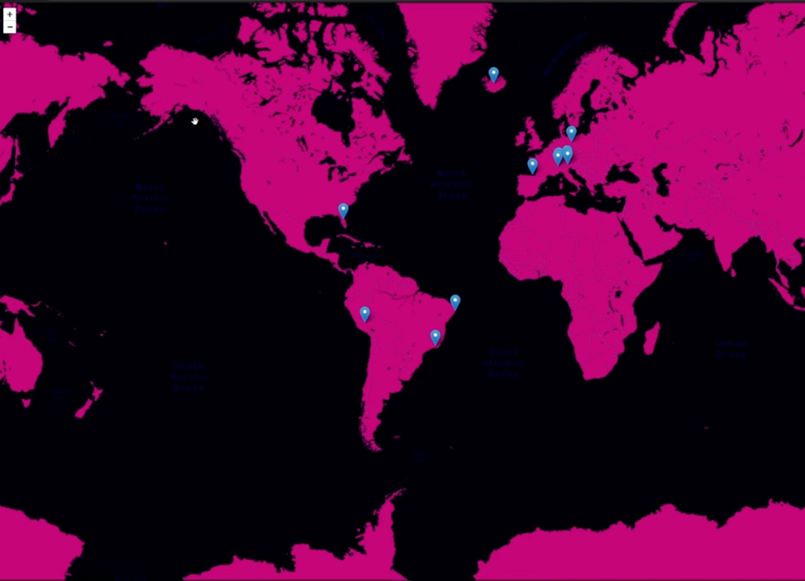

<h1 align="center">
  My Trips
</h1>

<p align="center">
  <a href="#-technology">Technology</a>&nbsp;&nbsp;&nbsp;|&nbsp;&nbsp;&nbsp;
  <a href="#-project">Project</a>&nbsp;&nbsp;&nbsp;|&nbsp;&nbsp;&nbsp;
  <a href="#-executing">Executing</a>&nbsp;&nbsp;&nbsp;
</p>

<br>

<p align="center">
  
</p>

## 🚀 Technology

This project was developed with:

- React
- Next.js
- Typescript
- GraphCMS
- Leaflet
- Graphql
- Styled Components
- Next Seo

## 🔖 Project

A simple website to show you which places you visit or want to visit. In addition, you can view the information for each tag

## 💻 Executing

This project was develop with [Next.js](https://nextjs.org/docs).

After creating your account on [GraphCMS](https://graphcms.com/) and following the steps above, you just need to rename
the `.env.example` to `.env.local` (if you plan to run locally) and edit the keys there.

In order to create a token access, go to `Settings > API Access`, inside this page, find `Permanent Auth Tokens`,
create a Token Name and mark all queries possible. Save and get the token.

This project uses [GraphCMS](https://graphcms.com/), so you need to create an account there first.

After you need to create the Schema, just follow the steps:

- Schema > Add New Model with `Place` name
- And add the following fields:
  - `Single Line Text` as `name`
  - `Slug` as `slug`
  - `Map` as `location`
  - `Rich Text` as `description`
  - `Asset Picker` as `gallery`

- Schema > Add New Model with `Page` name
- And add the following fields:
  - `Single Line Text` as `heading`
  - `Slug` as `slug`
  - `Rich Text` as `body`

After that, fill some values and don't forget to `publish`!

```sh
# Clone this project
$ git clone git@github.com:italo-lima/my-trips.git
# Install dependencies
$ yarn
# Run the project
$ yarn dev
# The server will initialize in the <http://localhost:3000>
```
